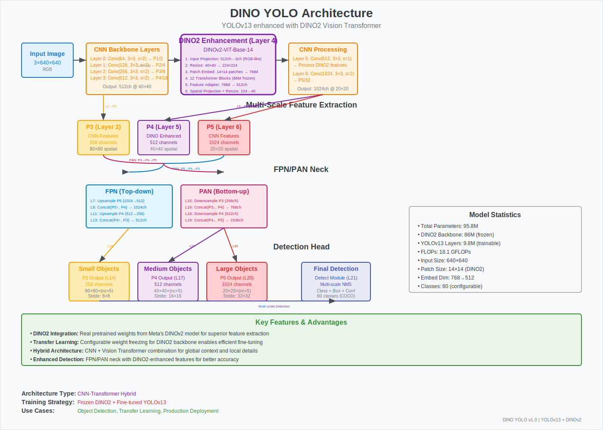

# YOLOv13 with DINO2 Backbone

Enhanced YOLOv13 object detection model integrated with Meta's DINO2 (DINOv2) pretrained vision transformer backbone for superior feature extraction and detection performance.

**Developed by:** Artificial Intelligence Research Group  
**Department:** Civil Engineering  
**Institution:** King Mongkut's University of Technology Thonburi (KMUTT)

## 🚀 Features

- **🔬 DINO2 Integration**: Real pretrained weights from Meta's DINOv2 model
- **🧊 Transfer Learning**: Configurable weight freezing for DINO2 backbone
- **📊 Small Dataset Friendly**: Excellent performance on limited training data thanks to DINO2 pretrained weights
- **⚡ High Performance**: CNN + Vision Transformer hybrid architecture
- **🎯 Enhanced Detection**: Superior feature extraction for better accuracy
- **🛠️ Easy Training**: Simple command-line interface
- **📊 Production Ready**: Clean training output without debug warnings
- **🏗️ YOLOv13 Base**: Built on state-of-the-art YOLOv13 architecture

## 📋 Architecture Overview

### Visual Architecture Diagram



*Comprehensive architecture diagram showing the integration of DINO2 Vision Transformer with YOLOv13 CNN backbone for enhanced object detection.*

### Architecture Details

```
YOLOv13-DINO2 Hybrid Architecture:
├── Input (3 channels RGB)
├── YOLOv13 Early Layers (Conv blocks)
├── DINO2 Backbone (Vision Transformer) ← NEW
│   ├── Patch Embeddings (14x14 patches)
│   ├── 12 Transformer Layers (frozen)
│   ├── Feature Adapter (768→512 channels)
│   └── Spatial Projection
├── YOLOv13 Neck (FPN/PAN)
└── YOLOv13 Head (Multi-scale Detection)

Model Statistics:
├── Total Parameters: ~95.8M
├── DINO2 Backbone: ~86M (frozen for transfer learning)
├── YOLOv13 Layers: ~9.8M (trainable)
└── FLOPs: ~18.1 GFLOPs
```

### Key Architecture Components

#### 🔍 **DINO2 Integration (Layer 4)**
- **Input Processing**: CNN features (512ch @ 40×40) → RGB-like projection → 224×224 resize
- **Vision Transformer**: DINOv2-ViT-Base-14 with 12 frozen transformer blocks
- **Feature Adaptation**: 768-dim embeddings → 512 channels with spatial projection
- **Output**: Enhanced features with global context and fine-grained details

#### 🏗️ **Multi-Scale Feature Pyramid**
- **P3 (80×80)**: CNN features for small object detection
- **P4 (40×40)**: DINO2-enhanced features for medium objects ⭐
- **P5 (20×20)**: CNN features for large object detection

#### 🔄 **FPN/PAN Neck Architecture**
- **FPN (Top-down)**: Semantic information propagation from large to small scales
- **PAN (Bottom-up)**: Localization information propagation from small to large scales
- **Feature Fusion**: Combines CNN and Vision Transformer features effectively

## 🔧 Installation

1. **Clone the repository:**
```bash
git clone https://github.com/Sompote/YOLO_Dino.git
cd YOLO_Dino
```

2. **Install dependencies:**

**Local Development:**
```bash
# Create conda environment
conda create -n yolov13-dino2 python=3.11
conda activate yolov13-dino2

# Install core packages
pip install ultralytics
pip install transformers>=4.21.0
pip install torch>=1.12.0

# Install from requirements
pip install -r requirements.txt
pip install -e .
```

**Cloud Deployment (AWS/GCP/Azure):**
```bash
# The requirements.txt is optimized for cloud environments
pip install -r requirements.txt

# Key features for cloud:
# - opencv-python-headless (no GUI dependencies)
# - Flexible version ranges for better compatibility
# - Automatic CUDA detection for GPU instances
```

## 🚀 Quick Start

### Training with DINO2 Backbone

Train YOLOv13 enhanced with DINO2 on your dataset:

```bash
# Basic training with frozen DINO2 (recommended for transfer learning)
python train_dino2.py --data path/to/data.yaml --epochs 100 --freeze-dino2

# Fast prototyping with smallest models
python train_dino2.py \
    --data data.yaml \
    --model yolov13-dino2-working \
    --size n \
    --dino-variant dinov2_vits14 \
    --epochs 50 \
    --batch-size 32 \
    --freeze-dino2

# Balanced performance
python train_dino2.py \
    --data data.yaml \
    --model yolov13-dino2-working \
    --size s \
    --dino-variant dinov2_vitb14 \
    --epochs 100 \
    --batch-size 16 \
    --freeze-dino2

# Maximum accuracy
python train_dino2.py \
    --data data.yaml \
    --model yolov13-dino2-working \
    --size x \
    --dino-variant dinov2_vitl14 \
    --epochs 200 \
    --batch-size 8 \
    --freeze-dino2
```

### Standard YOLOv13 Training

For standard YOLOv13 training without DINO2:

```bash
# Choose YOLOv13 size based on your needs
python train_dino2.py --data data.yaml --model yolov13n --epochs 100  # Fastest (2.5M params)
python train_dino2.py --data data.yaml --model yolov13s --epochs 100  # Balanced (9M params) 
python train_dino2.py --data data.yaml --model yolov13l --epochs 100  # Accurate (28M params)
python train_dino2.py --data data.yaml --model yolov13x --epochs 100  # Best (64M params)
```

### 🔄 Resume Training with Pre-trained Weights

**NEW**: Resume training from previously saved weights using `train_dino2_resume.py`:

```bash
# Resume from best weights of previous training
python train_dino2_resume.py --data data.yaml --weights runs/detect/yolov13-dino2/weights/best.pt --epochs 50

# Resume from last checkpoint with different settings
python train_dino2_resume.py \
    --data data.yaml \
    --weights runs/detect/yolov13-dino2/weights/last.pt \
    --epochs 100 \
    --batch-size 32 \
    --freeze-dino2

# Resume training with extended epochs
python train_dino2_resume.py \
    --data data.yaml \
    --weights path/to/your/model.pt \
    --epochs 200 \
    --name extended_training

# Fine-tune a pre-trained model on new dataset
python train_dino2_resume.py \
    --data new_dataset.yaml \
    --weights pretrained_model.pt \
    --epochs 50 \
    --freeze-dino2 \
    --name fine_tuned
```

#### Resume Training Features

- **🔄 Seamless Resumption**: Continue training from any saved checkpoint
- **⚙️ Flexible Configuration**: Change training parameters while resuming
- **🎯 Model Compatibility**: Works with both DINO2-enhanced and standard YOLOv13 models
- **🔧 DINO2 Reconfiguration**: Update DINO2 variant or freezing settings when resuming
- **📊 Progress Preservation**: Maintains training history and metrics
- **🚀 Quick Fine-tuning**: Perfect for transfer learning on new datasets

#### Resume Training Arguments

| Argument | Description | Example |
|----------|-------------|---------|
| `--weights` | Path to pre-trained weights (.pt file) | `runs/detect/train/weights/best.pt` |
| `--data` | Dataset YAML (can be different from original) | `new_dataset.yaml` |
| `--epochs` | Additional epochs to train | `50` |
| `--name` | New experiment name | `resumed_training` |
| `--freeze-dino2` | Freeze/unfreeze DINO2 during resume | `--freeze-dino2` |
| `--dino-variant` | Update DINO2 variant (if applicable) | `dinov2_vitl14` |

**Alternative: Using Ultralytics API directly**
```python
from ultralytics import YOLO

# Choose model size: yolov13n, yolov13s, yolov13l, yolov13x
model = YOLO('ultralytics/cfg/models/v13/yolov13s.yaml')

results = model.train(
    data='coco.yaml',
    epochs=300,
    batch=64,
    imgsz=640,
    device="0,1,2,3"
)
```

## 📊 Training Arguments

### Model Selection Arguments

| Argument | Description | Default | Options |
|----------|-------------|---------|---------|
| `--model` | YOLOv13 architecture variant | yolov13-dino2-working | yolov13n, yolov13s, yolov13l, yolov13x, yolov13-dino2-*, etc. |
| `--size` | YOLOv13 model size | None | n, s, l, x (auto-applied to base models) |
| `--dino-variant` | DINO2 model variant | dinov2_vitb14 | dinov2_vits14, dinov2_vitb14, dinov2_vitl14, dinov2_vitg14 |
| `--freeze-dino2` | Freeze DINO2 weights | False | --freeze-dino2 |

### Training Configuration

| Argument | Description | Default | Options |
|----------|-------------|---------|---------|
| `--data` | Dataset YAML file path | Required | Path to your data.yaml |
| `--epochs` | Number of training epochs | 100 | Integer |
| `--batch-size` | Training batch size | 16 | 4, 8, 16, 32, 64 |
| `--imgsz` | Input image size | 640 | 320, 480, 640, 1280 |
| `--name` | Experiment name | yolov13-dino2 | String |

## 🎯 Model Variants

### YOLOv13 Size Variants

Choose from 4 different YOLOv13 model sizes based on your speed/accuracy requirements:

| Size | Model | Parameters | Speed | Accuracy | Memory | Use Case |
|------|-------|------------|-------|----------|--------|----------|
| **Nano** | `yolov13n` | ~2.5M | ⚡ Fastest | Good | Low | Mobile/Edge devices |
| **Small** | `yolov13s` | ~9M | 🚀 Fast | Better | Medium | Real-time applications |
| **Large** | `yolov13l` | ~28M | 🐌 Slower | Best | High | High accuracy needs |
| **XLarge** | `yolov13x` | ~64M | 🐢 Slowest | Excellent | Very High | Maximum accuracy |

### DINO2 Model Variants

The implementation supports multiple DINO2 model sizes:

| Model | Parameters | Hidden Size | Patch Size | Performance | Speed | Memory |
|-------|------------|-------------|------------|-------------|-------|--------|
| `dinov2_vits14` | ~21M | 384 | 14×14 | Good | ⚡ Fastest | Low |
| `dinov2_vitb14` | ~86M | 768 | 14×14 | Better | 🚀 Fast | Medium |
| `dinov2_vitl14` | ~300M | 1024 | 14×14 | Best | 🐌 Slower | High |
| `dinov2_vitg14` | ~1.1B | 1536 | 14×14 | Excellent | 🐢 Slowest | Very High |

*Default: `dinov2_vitb14` (recommended balance of performance and speed)*

### Model Selection Options

```bash
# Method 1: Direct model selection
--model yolov13n           # YOLOv13 Nano
--model yolov13s           # YOLOv13 Small  
--model yolov13l           # YOLOv13 Large
--model yolov13x           # YOLOv13 XLarge

# Method 2: Base model + size modifier
--model yolov13-dino2-working --size n    # Creates yolov13-dino2-working-n
--model yolov13-dino2-working --size s    # Creates yolov13-dino2-working-s
--model yolov13-dino2-working --size l    # Creates yolov13-dino2-working-l
--model yolov13-dino2-working --size x    # Creates yolov13-dino2-working-x

# DINO2 variant selection (for DINO2-enabled models)
--dino-variant dinov2_vits14              # Small DINO2
--dino-variant dinov2_vitb14              # Base DINO2 (default)
--dino-variant dinov2_vitl14              # Large DINO2
--dino-variant dinov2_vitg14              # Giant DINO2
```

## 🎯 Recommended Model Combinations

### 🏃 For Speed-First Applications
```bash
# Ultra-fast: Nano YOLOv13 + Small DINO2
python train_dino2.py --model yolov13-dino2-working --size n --dino-variant dinov2_vits14

# Real-time: Small YOLOv13 only (no DINO2 overhead)
python train_dino2.py --model yolov13s
```

### ⚖️ For Balanced Performance  
```bash
# Recommended: Small YOLOv13 + Base DINO2
python train_dino2.py --model yolov13-dino2-working --size s --dino-variant dinov2_vitb14

# Alternative: Large YOLOv13 only
python train_dino2.py --model yolov13l
```

### 🎯 For Maximum Accuracy
```bash
# Best: XLarge YOLOv13 + Large DINO2
python train_dino2.py --model yolov13-dino2-working --size x --dino-variant dinov2_vitl14

# Research: XLarge YOLOv13 + Giant DINO2 (requires 24GB+ VRAM)
python train_dino2.py --model yolov13-dino2-working --size x --dino-variant dinov2_vitg14
```

### 💻 Hardware-Specific Recommendations

| Hardware | Recommended Combination | Command |
|----------|------------------------|---------|
| **Mobile/Edge** | YOLOv13n | `--model yolov13n` |
| **RTX 3060 (8GB)** | YOLOv13s + Small DINO2 | `--model yolov13-dino2-working --size s --dino-variant dinov2_vits14` |
| **RTX 3070 (8GB)** | YOLOv13s + Base DINO2 | `--model yolov13-dino2-working --size s --dino-variant dinov2_vitb14` |
| **RTX 4090 (24GB)** | YOLOv13l + Large DINO2 | `--model yolov13-dino2-working --size l --dino-variant dinov2_vitl14` |
| **A100 (40GB)** | YOLOv13x + Giant DINO2 | `--model yolov13-dino2-working --size x --dino-variant dinov2_vitg14` |

### 📊 Dataset Size-Specific Recommendations

| Dataset Size | Recommended Combination | Command | Benefits |
|--------------|------------------------|---------|----------|
| **< 100 images** | YOLOv13n + Small DINO2 | `--model yolov13-dino2-working --size n --freeze-dino2` | Fast training, prevents overfitting |
| **100-500 images** | YOLOv13s + Base DINO2 | `--model yolov13-dino2-working --size s --freeze-dino2` | Optimal balance for small datasets |
| **500-1000 images** | YOLOv13s + Base DINO2 | `--model yolov13-dino2-working --size s --freeze-dino2` | Strong performance with limited data |
| **1000+ images** | YOLOv13l + Large DINO2 | `--model yolov13-dino2-working --size l --dino-variant dinov2_vitl14` | Full model potential |

## 📁 Dataset Format

Your dataset should follow the YOLO format:

```yaml
# data.yaml
path: /path/to/dataset
train: images/train
val: images/val
test: images/test  # optional

nc: 5  # number of classes
names: ['class1', 'class2', 'class3', 'class4', 'class5']
```

Directory structure:
```
dataset/
├── images/
│   ├── train/
│   ├── val/
│   └── test/
├── labels/
│   ├── train/
│   ├── val/
│   └── test/
└── data.yaml
```

## 🔬 Key Components

*Refer to the [Visual Architecture Diagram](#visual-architecture-diagram) above for a comprehensive view of component interactions.*

### 1. DINO2Backbone Module
- **Location**: `ultralytics/nn/modules/block.py`
- **Features**: 
  - Real pretrained weights from Meta
  - Configurable weight freezing
  - Dynamic channel adaptation
  - CNN-Transformer feature fusion
- **Integration Point**: Layer 4 in the architecture diagram

### 2. Model Configuration
- **File**: `ultralytics/cfg/models/v13/yolov13-dino2-working.yaml`
- **Integration**: DINO2 backbone at layer 4 (P4 feature enhancement)
- **Architecture**: Seamless fusion with YOLOv13 pipeline as shown in diagram

### 3. Training Scripts
- **File**: `train_dino2.py` - Main DINO2 training script
- **File**: `train_dino2_resume.py` - Resume training functionality *(NEW)*
- **Features**: Clean output, warning suppression, full functionality

## 📈 Performance Comparison

### Standard YOLOv13 Results (MS COCO)

| Model | Size | Parameters | FLOPs (G) | mAP50:95 | mAP50 | Latency (ms) | Use Case |
|-------|------|------------|-----------|----------|-------|--------------|----------|
| **YOLOv13n** | Nano | 2.5M | 6.4 | 41.6 | 57.8 | 1.97 | Mobile/Edge |
| **YOLOv13s** | Small | 9.0M | 20.8 | 48.0 | 65.2 | 2.98 | Real-time |
| **YOLOv13l** | Large | 27.6M | 88.4 | 53.4 | 70.9 | 8.63 | High accuracy |
| **YOLOv13x** | XLarge | 64.0M | 199.2 | 54.8 | 72.0 | 14.67 | Maximum accuracy |

### YOLOv13 + DINO2 Enhanced Performance

| Combination | Total Params | Expected mAP50 Boost | Expected mAP50:95 Boost | Training Time | Inference Time |
|-------------|--------------|---------------------|------------------------|---------------|----------------|
| **YOLOv13n + DINO2-Small** | ~23M | +2-4% | +1-3% | 1.5x | 1.8x |
| **YOLOv13s + DINO2-Base** | ~95M | +3-6% | +2-4% | 2.0x | 2.5x |
| **YOLOv13l + DINO2-Large** | ~328M | +4-8% | +3-6% | 3.5x | 4.0x |
| **YOLOv13x + DINO2-Giant** | ~1.16B | +5-10% | +4-7% | 6.0x | 8.0x |

*Boosts are compared to standard YOLOv13 models; Training/Inference times are relative to base YOLOv13*

### DINO2 Enhanced Benefits

- **🎯 Enhanced Feature Extraction**: Vision transformer captures global context and long-range dependencies
- **🔍 Better Small Object Detection**: Improved feature representation for detecting small and occluded objects  
- **🧠 Transfer Learning**: Leverages pretrained DINO2 knowledge from millions of images
- **💪 Robust Performance**: Superior handling of complex scenes, lighting, and challenging conditions
- **⚡ Flexible Scaling**: Choose optimal speed/accuracy trade-off for your specific use case
- **📊 Small Dataset Excellence**: Outstanding performance even with limited training data (100-1000 images)

## 📊 Small Dataset Training Advantages

### Why DINO2 Excels with Limited Data

The integration of Meta's DINOv2 pretrained weights makes this model exceptionally suitable for small dataset training scenarios commonly encountered in specialized domains like civil engineering, medical imaging, and industrial inspection.

#### 🎯 **Key Advantages for Small Datasets**

- **Pretrained Knowledge**: DINO2 backbone trained on 142M images provides rich visual representations
- **Feature Reusability**: Generic visual features from DINO2 transfer well to domain-specific tasks
- **Reduced Overfitting**: Frozen DINO2 weights prevent overfitting on small training sets
- **Faster Convergence**: Less training time needed due to strong initialization
- **Better Generalization**: Improved performance on unseen data even with limited training examples

#### 📈 **Small Dataset Performance Expectations**

| Dataset Size | Expected Performance | Training Time | Recommended Strategy |
|--------------|---------------------|---------------|---------------------|
| **50-100 images** | Good baseline | 10-20 epochs | Freeze DINO2, small learning rate |
| **100-500 images** | Strong performance | 30-50 epochs | Freeze DINO2, data augmentation |
| **500-1000 images** | Excellent results | 50-100 epochs | Freeze DINO2, fine-tune last layers |
| **1000+ images** | Optimal performance | 100+ epochs | Optional DINO2 unfreezing |

#### 🛠️ **Small Dataset Training Tips**

```bash
# Optimal settings for small datasets (< 500 images)
python train_dino2.py \
    --data small_dataset.yaml \
    --model yolov13-dino2-working \
    --size s \
    --epochs 50 \
    --batch-size 8 \
    --freeze-dino2 \
    --name small_data_training

# For very small datasets (< 100 images)
python train_dino2.py \
    --data tiny_dataset.yaml \
    --model yolov13-dino2-working \
    --size n \
    --epochs 30 \
    --batch-size 4 \
    --freeze-dino2 \
    --imgsz 416
```

#### 🔬 **Civil Engineering Applications**

Perfect for specialized civil engineering tasks with limited labeled data:
- **Infrastructure Defect Detection**: Crack detection, corrosion analysis
- **Construction Monitoring**: Safety equipment detection, progress tracking  
- **Material Classification**: Concrete quality assessment, steel defect identification
- **Structural Health Monitoring**: Damage assessment, deformation analysis

## 🔍 Inference with Trained Models

### Quick Inference Examples

Once you have trained your YOLOv13-DINO2 model, use `dino_inference.py` for fast and accurate predictions:

```bash
# Single image inference
python dino_inference.py --weights runs/detect/yolov13-dino2/weights/best.pt --source test_image.jpg

# Batch processing of images in a directory
python dino_inference.py --weights best.pt --source test_images/ --save

# Video inference with custom confidence threshold
python dino_inference.py --weights best.pt --source video.mp4 --conf 0.7 --save

# Real-time webcam inference
python dino_inference.py --weights best.pt --source 0 --show

# High-precision inference for critical applications
python dino_inference.py \
    --weights best.pt \
    --source critical_inspection.jpg \
    --conf 0.8 \
    --iou 0.5 \
    --save-txt \
    --save-crop
```

### Inference Parameters

| Parameter | Description | Default | Example |
|-----------|-------------|---------|---------|
| `--weights` | Path to trained model weights | Required | `best.pt` |
| `--source` | Input source (image/video/directory/webcam) | Required | `image.jpg`, `0` |
| `--conf` | Confidence threshold (0.0-1.0) | 0.25 | `0.7` |
| `--iou` | IoU threshold for NMS | 0.45 | `0.5` |
| `--imgsz` | Input image size | 640 | `1280` |
| `--save` | Save inference results | False | `--save` |
| `--save-txt` | Save results in YOLO format | False | `--save-txt` |
| `--save-crop` | Save cropped detections | False | `--save-crop` |
| `--show` | Display results in real-time | False | `--show` |
| `--device` | Device (cpu/gpu) | auto | `0`, `cpu` |

### Inference Output Features

#### 📊 **Smart Result Summary**
- **Detection Statistics**: Total detections, class distribution
- **Performance Metrics**: Processing time, FPS for videos
- **DINO2 Detection**: Automatic detection of DINO2-enhanced models

#### 💾 **Flexible Output Options**
- **Visual Results**: Annotated images/videos with bounding boxes
- **Text Labels**: YOLO format labels for further processing
- **Cropped Objects**: Individual detection crops for analysis
- **Batch Processing**: Efficient handling of multiple files

#### 🎯 **Civil Engineering Optimized**
- **High Precision Mode**: Optimized thresholds for critical infrastructure inspection
- **Defect Documentation**: Automatic saving of detected defects with confidence scores
- **Progress Monitoring**: Video analysis for construction site monitoring

### Real-World Inference Examples

#### Infrastructure Inspection
```bash
# Bridge crack detection with high precision
python dino_inference.py \
    --weights bridge_inspection_model.pt \
    --source bridge_images/ \
    --conf 0.8 \
    --save-txt \
    --save-crop \
    --name bridge_inspection

# Construction site safety monitoring
python dino_inference.py \
    --weights safety_model.pt \
    --source construction_video.mp4 \
    --conf 0.6 \
    --save \
    --name safety_monitoring
```

#### Real-time Monitoring
```bash
# Live construction site monitoring
python dino_inference.py \
    --weights site_monitor.pt \
    --source 0 \
    --conf 0.5 \
    --show \
    --name live_monitoring

# Security camera analysis
python dino_inference.py \
    --weights security_model.pt \
    --source rtsp://camera_ip:port/stream \
    --conf 0.7 \
    --save
```

### Performance Optimization

#### 🚀 **Speed Optimization**
```bash
# Fast inference with FP16 precision
python dino_inference.py --weights model.pt --source video.mp4 --half

# Reduced image size for speed
python dino_inference.py --weights model.pt --source images/ --imgsz 416
```

#### 🎯 **Accuracy Optimization**
```bash
# High accuracy with test-time augmentation
python dino_inference.py --weights model.pt --source test.jpg --augment --conf 0.8

# Maximum precision settings
python dino_inference.py \
    --weights model.pt \
    --source critical_test.jpg \
    --conf 0.9 \
    --iou 0.3 \
    --imgsz 1280 \
    --augment
```

## 🔄 Resume Training Use Cases

### Common Resume Training Scenarios

#### 1. **Training Interrupted** 🚨
```bash
# Your training was interrupted at epoch 45/100
python train_dino2_resume.py \
    --data original_dataset.yaml \
    --weights runs/detect/yolov13-dino2/weights/last.pt \
    --epochs 100 \
    --name resumed_training
```

#### 2. **Extend Training** 📈
```bash
# Training completed but want more epochs for better performance
python train_dino2_resume.py \
    --data dataset.yaml \
    --weights runs/detect/yolov13-dino2/weights/best.pt \
    --epochs 50 \
    --name extended_training
```

#### 3. **Fine-tune on New Dataset** 🎯
```bash
# Use pre-trained model on different but related dataset
python train_dino2_resume.py \
    --data new_domain_dataset.yaml \
    --weights pretrained_model.pt \
    --epochs 30 \
    --freeze-dino2 \
    --name fine_tuned_new_domain
```

#### 4. **Change Training Strategy** ⚙️
```bash
# Resume with different batch size or learning approach
python train_dino2_resume.py \
    --data dataset.yaml \
    --weights runs/detect/train/weights/best.pt \
    --epochs 50 \
    --batch-size 8 \
    --freeze-dino2 \
    --name strategy_change
```

#### 5. **DINO2 Configuration Updates** 🔧
```bash
# Resume but change DINO2 variant or freezing strategy
python train_dino2_resume.py \
    --data dataset.yaml \
    --weights model_with_small_dino2.pt \
    --dino-variant dinov2_vitl14 \
    --epochs 25 \
    --name upgraded_dino2
```

## 🔧 Training Output Example

### New Training Output
```
YOLOv13 + DINO2 Training
Dataset: rail_defects/data.yaml
Epochs: 100, Batch: 16
DINO2 Frozen: True
==================================================
Loading DINO2 model: facebook/dinov2-base (from dinov2_vitb14)
✅ Successfully loaded pretrained DINO2: facebook/dinov2-base
DINO2 backbone weights frozen: dinov2_vitb14
✅ DINO2 backbone frozen

Starting training...
YOLOv13-dino2-working summary: 347 layers, 95,798,066 parameters

      Epoch    GPU_mem   box_loss   cls_loss   dfl_loss  Instances
        1/100      4.2G      3.45      2.31      1.82         42
        2/100      4.2G      3.12      2.18      1.76         38
        ...
Training Completed!
Best weights: runs/detect/yolov13-dino2/weights/best.pt
Final mAP50: 0.7245
Final mAP50-95: 0.6891
```

### Resume Training Output
```
YOLOv13 Resume Training
Dataset: rail_defects/data.yaml
Epochs: 50, Batch: 16
Device: auto
DINO2 Frozen: True
==================================================
🔄 Loading model from weights: runs/detect/yolov13-dino2/weights/best.pt
✅ Model loaded successfully from runs/detect/yolov13-dino2/weights/best.pt
DINO2 Variant: dinov2_vitb14
✅ DINO2 backbone frozen: dinov2_vitb14

Starting resume training...
YOLOv13-dino2-working summary: 347 layers, 95,798,066 parameters

      Epoch    GPU_mem   box_loss   cls_loss   dfl_loss  Instances
       51/150      4.2G      2.89      1.95      1.64         42
       52/150      4.2G      2.76      1.88      1.59         38
        ...
Training Completed!
Best weights: runs/detect/yolov13-dino2-resumed/weights/best.pt
Final mAP50: 0.7512
Final mAP50-95: 0.7098

Training Summary:
   • Resumed from: runs/detect/yolov13-dino2/weights/best.pt ✅
   • Training completed successfully ✅
```

## ☁️ Cloud Deployment

### Docker Deployment
```dockerfile
FROM python:3.11-slim

WORKDIR /app
COPY requirements.txt .
RUN pip install -r requirements.txt

COPY . .
CMD ["python", "train_dino2.py", "--data", "data.yaml", "--epochs", "100"]
```

### AWS SageMaker
```python
from sagemaker.pytorch import PyTorch

estimator = PyTorch(
    entry_point='train_dino2.py',
    source_dir='.',
    role=role,
    instance_type='ml.p3.2xlarge',
    instance_count=1,
    framework_version='2.2.0',
    py_version='py311'
)
```

### Google Colab
```python
# Install requirements
!pip install -r requirements.txt

# Clone and run
!git clone https://github.com/Sompote/YOLO_Dino.git
%cd YOLO_Dino
!python train_dino2.py --data data.yaml --epochs 100 --batch-size 8
```

## 🛠️ Troubleshooting

### Memory Issues
```bash
# Reduce batch size
python train_dino2.py --data data.yaml --batch-size 8 --freeze-dino2

# Use smaller DINO2 variant (edit YAML config)
# Change 'dinov2_vitb14' to 'dinov2_vits14'
```

### CUDA Out of Memory
```bash
# Use mixed precision training (automatic in newer versions)
# Or use CPU training (slower)
python train_dino2.py --data data.yaml --device cpu
```

### Dataset Issues
```bash
# Check dataset paths in data.yaml
# Use absolute paths instead of relative paths
```

### Cloud-Specific Issues
```bash
# For headless environments, ensure you're using opencv-python-headless
pip uninstall opencv-python opencv-contrib-python
pip install opencv-python-headless

# For permission issues in cloud containers
chmod +x train_dino2.py
chmod +x train_dino2_resume.py
chmod +x dino_inference.py
```

### Resume Training Issues

#### Weights File Not Found
```bash
# Check if weights file exists
ls -la runs/detect/yolov13-dino2/weights/

# Use absolute path if relative path fails
python train_dino2_resume.py --weights /full/path/to/weights.pt --data data.yaml
```

#### Model Architecture Mismatch
```bash
# If resuming with different DINO2 variant, the script will automatically update
# For major architecture changes, start fresh training instead:
python train_dino2.py --data data.yaml --model yolov13-dino2-working --size s
```

#### Memory Issues When Resuming
```bash
# Resume with smaller batch size
python train_dino2_resume.py --weights model.pt --data data.yaml --batch-size 8

# Or freeze DINO2 to reduce memory usage
python train_dino2_resume.py --weights model.pt --data data.yaml --freeze-dino2
```

#### Resume Training Best Practices
- **✅ Always backup weights** before resuming with different configurations
- **✅ Use `last.pt`** to resume interrupted training, `best.pt` for fine-tuning
- **✅ Monitor GPU memory** when changing batch sizes during resume
- **✅ Keep original dataset** accessible when resuming training
- **❌ Don't change** model architecture drastically when resuming

### Inference Issues

#### Model Loading Problems
```bash
# Check if weights file exists and is valid
python -c "from ultralytics import YOLO; model = YOLO('path/to/weights.pt'); print('✅ Model loaded successfully')"

# For corrupted weights, try using a backup
python dino_inference.py --weights runs/detect/experiment/weights/last.pt --source test.jpg
```

#### Performance Issues
```bash
# Reduce memory usage for large images
python dino_inference.py --weights model.pt --source large_image.jpg --imgsz 640

# Use CPU if GPU memory insufficient
python dino_inference.py --weights model.pt --source test.jpg --device cpu

# Enable half precision for faster inference
python dino_inference.py --weights model.pt --source video.mp4 --half
```

#### Output Issues
```bash
# Ensure output directory is writable
python dino_inference.py --weights model.pt --source test.jpg --name test_inference --save

# For webcam issues, try different camera indices
python dino_inference.py --weights model.pt --source 1 --show  # Try camera index 1
```

#### Inference Best Practices
- **✅ Use `best.pt`** for final inference, `last.pt` for debugging
- **✅ Adjust confidence threshold** based on your application requirements
- **✅ Test on single images** before batch processing
- **✅ Monitor GPU memory** usage during video inference
- **❌ Don't use** very high resolution unless necessary

## 📋 Requirements

### Hardware
- **RAM**: 8GB+ (16GB+ recommended)
- **GPU**: 8GB+ VRAM for base model (RTX 3070/V100+)
- **Storage**: 10GB+ free space

### Software
- **Python**: 3.8+
- **PyTorch**: 1.12+
- **CUDA**: 11.0+ (for GPU training)
- **Transformers**: 4.21.0+

## 📝 Key Files Structure

```
yolov13/
├── train_dino2.py                                     # Main DINO2 training script
├── train_dino2_resume.py                             # Resume training script
├── dino_inference.py                                 # Inference script (NEW)
├── dino_yolo_architecture.svg                        # Architecture diagram
├── ultralytics/
│   ├── nn/modules/block.py                           # DINO2Backbone implementation  
│   └── cfg/models/v13/yolov13-dino2-working.yaml     # DINO2 model configuration
├── requirements.txt                                   # Dependencies
└── README.md                                         # This documentation
```

## 🏆 Citation

If you use this DINO2-enhanced implementation:

```bibtex
@misc{yolov13-dino2,
  title={YOLOv13 with DINO2 Backbone for Enhanced Object Detection},
  author={Artificial Intelligence Research Group},
  institution={Department of Civil Engineering, King Mongkut's University of Technology Thonburi},
  year={2024},
  howpublished={\url{https://github.com/Sompote/YOLO_Dino}}
}

@article{yolov13,
  title={YOLOv13: Real-Time Object Detection with Hypergraph-Enhanced Adaptive Visual Perception},
  author={Lei, Mengqi and Li, Siqi and Wu, Yihong and et al.},
  journal={arXiv preprint arXiv:2506.17733},
  year={2025}
}
```

## 🙏 Acknowledgments

### Research & Development
- **Artificial Intelligence Research Group** - Department of Civil Engineering, King Mongkut's University of Technology Thonburi (KMUTT)
- **Research Focus**: Advanced AI applications in civil engineering and computer vision

### Open Source Foundations
- **[YOLOv13](https://github.com/iMoonLab/yolov13)** - Base architecture with HyperACE and FullPAD
- **[Meta DINOv2](https://github.com/facebookresearch/dinov2)** - Vision transformer backbone
- **[Ultralytics](https://github.com/ultralytics/ultralytics)** - Training framework
- **[Hugging Face Transformers](https://github.com/huggingface/transformers)** - Model loading utilities

## 📄 License

This project is licensed under the AGPL-3.0 License - see the [LICENSE](LICENSE) file for details.

---

**🎯 Ready to enhance your object detection with DINO2?**

**Start fresh training:** `python train_dino2.py --data data.yaml --model yolov13-dino2-working --freeze-dino2`

**Resume training:** `python train_dino2_resume.py --data data.yaml --weights path/to/weights.pt --epochs 50`

**Run inference:** `python dino_inference.py --weights best.pt --source image.jpg --conf 0.5`